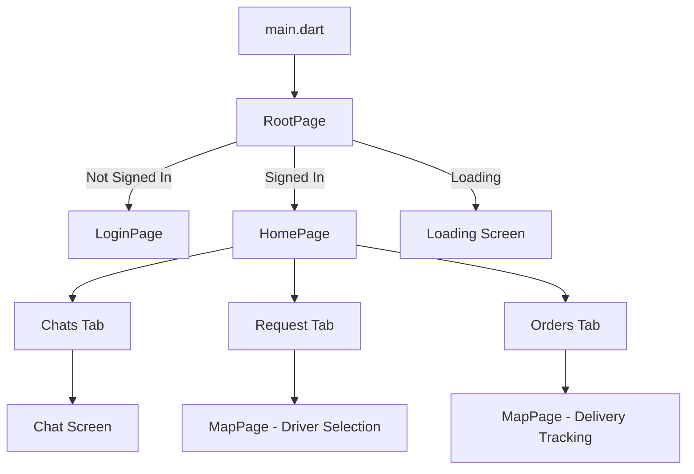

Trackmart is a Flutter mobile application that enables users to order, track, and receive goods deliveries. The app follows a layered architecture pattern with clear separation between UI, business logic, and data layers.

## Application Entry Point

The application starts at `main.dart:6`, which serves as the root entry point:

```dart main.dart
void main() => runApp(MyApp());

class MyApp extends StatelessWidget {
  @override
  Widget build(BuildContext context) {
    return MaterialApp(
      theme: new ThemeData(
        primaryColor: const Color(0xff004d40),
        primaryColorDark: const Color(0xff003e33),
        accentColor: const Color(0xff005B9A),
      ),
      home: RootPage(),
      debugShowCheckedModeBanner: false,
    );
  }
}
```

<Note>
The app uses Material Design with a teal and blue color scheme. The theme is consistently applied throughout the application.
</Note>

## Navigation Flow

Trackmart implements a hierarchical navigation structure with three main levels:

<Steps>
  <Step title="Root Page (Authentication Gateway)">
    `root_page.dart` manages the authentication state and determines which screen to display.
    
    **Authentication States:**
    - `notSignedIn` → Shows LoginPage
    - `signedIn` → Shows HomePage
    - `loading` → Shows loading spinner
    
    ```dart root_page.dart
    enum AuthStatus { notSignedIn, signedIn, loading }
    ```
  </Step>
  
  <Step title="Home Page (Main Application Hub)">
    Once authenticated, users land on `home_page.dart`, which provides a tabbed interface with three main sections:
    
    - **Chats Tab**: View and initiate conversations with drivers
    - **Request Tab**: Create new delivery requests
    - **Orders Tab**: View order history and status
  </Step>
  
  <Step title="Feature Pages">
    From the home page, users can navigate to various feature-specific pages:
    - Map view for tracking deliveries
    - Chat screens for driver communication
    - Settings and profile management
    - Order details and history
  </Step>
</Steps>

### Navigation Diagram



## Core Components

### 1. Authentication & Session Management

The `RootPage` component manages the entire authentication lifecycle:

<CodeGroup>
```dart Authentication State
class RootPageState extends State<RootPage> {
  AuthStatus authStatus = AuthStatus.loading;
  String currentUserId;
  Firestore firestore;
  
  @override
  void initState() {
    FirebaseAuth.instance.currentUser().then((user) {
      setState(() {
        authStatus = user == null 
          ? AuthStatus.notSignedIn 
          : AuthStatus.signedIn;
        if (user != null) {
          currentUserId = user.uid;
        }
      });
    });
  }
}
```

```dart Sign In Handler
void _signedIn(FirebaseUser user) async {
  String token = await firebaseMessaging.getToken();
  
  // Update token in Realtime Database
  await FirebaseDatabase.instance
      .reference()
      .child('users')
      .child(user.uid)
      .update({'deviceToken': token});
  
  // Update token in Firestore
  await firestore.collection('users')
      .document(user.uid)
      .updateData({'pushToken': token});
  
  setState(() {
    currentUserId = user.uid;
    authStatus = AuthStatus.signedIn;
  });
}
```
</CodeGroup>

<Info>
The app uses Firebase Cloud Messaging (FCM) for push notifications. Device tokens are stored in both Firebase Realtime Database and Cloud Firestore for redundancy.
</Info>

### 2. Push Notifications

Trackmart integrates Firebase Cloud Messaging with local notifications:

```dart root_page.dart
firebaseMessaging.configure(
  onMessage: (Map<String, dynamic> message) {
    showNotification(message['notification']);
    return;
  },
  onResume: (Map<String, dynamic> message) {
    // Handle notification tap when app is in background
    return;
  },
  onLaunch: (Map<String, dynamic> message) {
    // Handle notification tap when app is terminated
    return;
  }
);
```

### 3. Home Page Architecture

The home page uses a `StatefulWidget` with `TabController` for navigation:

<Accordion title="Home Page Structure">
```dart home_page.dart
class TabbedGuy extends StatefulWidget {
  final VoidCallback onSignedout;
  final String currentUserId;
  
  @override
  _TabbedGuyState createState() => _TabbedGuyState(
    currentUserId: this.currentUserId
  );
}

class _TabbedGuyState extends State<TabbedGuy> 
    with SingleTickerProviderStateMixin {
  
  TabController _tabController;
  DatabaseReference databaseReference;
  FirebaseDatabase database;
  cf.Firestore firestore;
  SharedPreferences prefs;
  
  @override
  void initState() {
    super.initState();
    _startup().then((value) {
      setState(() {
        _stillLoading = !value;
      });
    });
  }
}
```
</Accordion>

### 4. Real-time Location Tracking

The app continuously tracks user location and updates Firebase:

```dart home_page.dart
_updateLocation(Position position) {
  setState(() {
    currentLat = position.latitude;
    currentLong = position.longitude;
  });
  
  databaseReference
      .child('buyers')
      .child(currentUserId)
      .update({
        'lat': position.latitude,
        'long': position.longitude,
      });
}
```

<Warning>
Location tracking runs continuously in the background with a 10-meter distance filter. Ensure users grant location permissions for the app to function properly.
</Warning>

### 5. Map Integration

Trackmart uses Mapbox for map visualization and routing:

<CardGroup cols={2}>
  <Card title="MapPage" icon="map">
    Displays real-time delivery tracking with route visualization between driver and buyer locations.
    
    **Features:**
    - Live driver location updates
    - Route polyline rendering
    - ETA calculation
    - Distance display
  </Card>
  
  <Card title="MapPage2" icon="users">
    Shows all available drivers on a map with their distances and ETAs.
    
    **Features:**
    - Driver selection
    - Distance sorting
    - Real-time availability
    - Quick driver info
  </Card>
</CardGroup>

#### Route Calculation

```dart map.dart
var url = 'https://api.mapbox.com/directions/v5/mapbox/driving/'
  '${dlong},${dlat};${widget.ulong},${widget.ulat}'
  '?access_token=YOUR_MAPBOX_TOKEN';

http.get(url).then((response) {
  route = json.decode(response.body)['routes'][0];
  var k = PolylinePoints().decodePolyline(route['geometry']);
  
  setState(() {
    points = List.generate(k.length, (i) {
      return LatLng(k[i].latitude, k[i].longitude);
    });
    distance = '${(route['distance'] / 1000).toStringAsFixed(2)}km';
    duration = '${(route['duration'] / 60).toStringAsFixed(0)}min';
  });
});
```

### 6. Chat System

The chat feature enables direct communication between buyers and drivers:

```dart chat.dart
void onSendMessage(String content, int type) {
  // type: 0 = text, 1 = image, 2 = sticker
  if (content.trim() != '') {
    var documentReference = firestore
        .collection('messages')
        .document(groupChatId)
        .collection(groupChatId)
        .document(DateTime.now().millisecondsSinceEpoch.toString());
    
    firestore.runTransaction((transaction) async {
      await transaction.set(documentReference, {
        'idFrom': id,
        'idTo': peerId,
        'timestamp': DateTime.now().millisecondsSinceEpoch.toString(),
        'content': content,
        'type': type
      });
    });
  }
}
```

<Tip>
The chat system supports three message types: text messages (type 0), images (type 1), and stickers (type 2).
</Tip>

## Application Lifecycle

<Steps>
  <Step title="App Launch">
    - Initialize Firebase services
    - Check authentication status
    - Configure push notifications
  </Step>
  
  <Step title="Authentication">
    - User signs in via phone number or email
    - FCM token is registered
    - User data is loaded from SharedPreferences
  </Step>
  
  <Step title="Main Flow">
    - Location tracking starts
    - User can browse drivers, create orders, and chat
    - Real-time updates via Firebase listeners
  </Step>
  
  <Step title="Order Creation">
    - Select driver from map or list
    - Configure quantity and payment method
    - Submit request to Firebase
    - Track delivery in real-time
  </Step>
</Steps>

## Key Design Patterns

### StatefulWidget Pattern

Trackmart extensively uses `StatefulWidget` for managing component state:

- **RootPage**: Manages authentication state
- **HomePage/TabbedGuy**: Manages tab navigation and order state
- **MapPage**: Manages map state and real-time location
- **Chat**: Manages message state and input

### Stream-Based Updates

The app leverages Firebase streams for real-time data:

```dart
StreamBuilder(
  stream: databaseReference
      .child('buyers')
      .child(currentUserId)
      .child('requests')
      .onValue,
  builder: (context, snap) {
    // Update UI based on stream data
  }
)
```

### Async/Await for Data Loading

Asynchronous operations are handled with Future-based patterns:

```dart
Future<bool> _startup() async {
  database = FirebaseDatabase.instance;
  database.setPersistenceEnabled(true);
  
  prefs = await SharedPreferences.getInstance();
  currentUserName = prefs.getString('displayName');
  
  await geolocator.getCurrentPosition();
  
  return true;
}
```

## Performance Optimizations

<CardGroup cols={2}>
  <Card title="Firebase Persistence" icon="database">
    Both Realtime Database and Firestore have offline persistence enabled for better performance and offline capability.
  </Card>
  
  <Card title="Image Caching" icon="image">
    Uses `cached_network_image` package for efficient image loading and caching.
  </Card>
  
  <Card title="Location Filtering" icon="location-dot">
    Location updates are filtered to 10-meter changes to reduce unnecessary database writes.
  </Card>
  
  <Card title="Stream Optimization" icon="stream">
    Firebase queries use proper indexing and limit clauses to minimize data transfer.
  </Card>
</CardGroup>

## Related Documentation

<CardGroup cols={3}>
  <Card title="Database Schema" icon="table" href="./database-schema">
    Learn about the Firebase database structure
  </Card>
  
  <Card title="State Management" icon="sitemap" href="./state-management">
    Understand how app state is managed
  </Card>
  
  <Card title="API Integration" icon="plug" href="./api-integration">
    Explore external API integrations
  </Card>
</CardGroup>